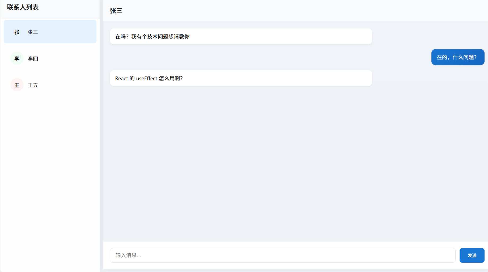

# 聊天应用 (Chat Application)

这是一个使用现代Web技术栈构建的实时聊天应用。


## 技术栈

### 前端
- **React 18** - 用于构建用户界面的JavaScript库
- **TypeScript** - 添加静态类型检查，提高代码可维护性
- **Vite** - 现代前端构建工具，提供极速的开发体验
- **MobX** - 简单、可扩展的状态管理方案
- **Axios** - 处理HTTP请求（模拟api）

## 项目功能

### 核心特性
- 📱 双栏布局设计
  - 左侧联系人列表
  - 右侧聊天窗口
- 💬 聊天功能
  - 实时消息发送与显示
  - 消息持久化存储
  - 区分发送方（绿框）和接收方（白框）消息样式
- 🔄 数据管理
  - Mock API 实现数据交互
  - 联系人切换时保持消息历史
- ⌨️ 消息输入
  - 支持文本消息发送
  - 表单提交实时更新消息列表

## 开始使用

```bash
# 安装依赖
npm install

# 启动开发服务器
npm run dev

# 构建生产版本
npm run build
```

## 技术实现
- 使用 React + TypeScript 确保代码质量
- MobX 进行状态管理
- Mock 服务模拟后端API
- CSS Modules 实现样式隔离
- Vite 提供开发环境

## 作者
[林则栋]

## 许可
MIT License
